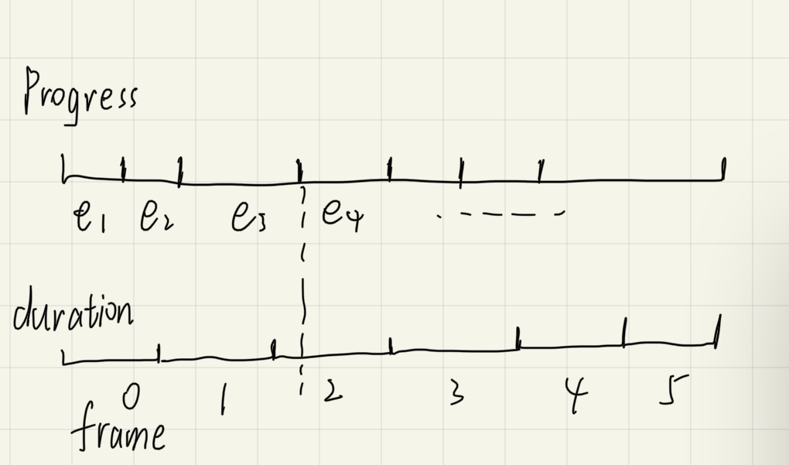

[Easy Animations With Spritesheets](https://github.com/SFML/SFML/wiki/Easy-Animations-With-Spritesheets)

## 思路

```cpp
struct Frame {
   sf::IntRect rect;
   double duration; // in seconds
};
```

用以上结构来描述帧

播放的方式如下:

```cpp
void Animation::update(double elapsed)
{
    progress += elapsed;
    double p = progress;
    for (size_t i = 0; i < frames.size(); i++)
    {
        p -= frames[i].duration;

        // if we have progressed OR if we're on the last frame, apply and stop.
        if (p <= 0.0 || &(frames[i]) == &frames.back())
        {
            target.setTextureRect(frames[i].rect);
            break; // we found our frame
        }
    }
}
```

外部参数 elapsed 是每一帧的时间间隔(是 main loop 两次函数的间隔, 也是上一帧的持续时间),
将 progress 是 elapsed 的累计, 也就是 animation 播放的 progress.

而 for 循环是根据 progress 找到对应帧, 并且更新 target 的 texture rect.


如下图所示:

